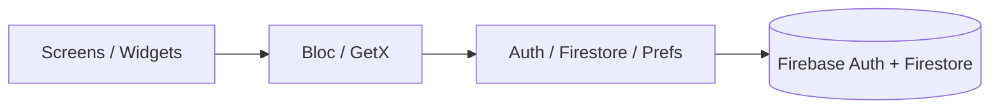

# Pacesetter (kings_store)

Flutter e-commerce app for browsing products by category, authenticating with Firebase, and managing a basic shopper profile. Package name in code: `kings_store`.

Built as a mobile frontend portfolio project — clean screens, Firebase Auth + Firestore, and Bloc/GetX for state.

## Features

- **Onboarding** — splash + intro flow driven by a Bloc
- **Auth** — email/password sign up and sign in via Firebase Auth; profile data written to Firestore; session helpers via SharedPreferences
- **Home** — greeting, search/filter UI, carousel banners, category chips (Food, Fashion, Grocery, Electronics), trending product cards
- **Catalog** — category and product detail screens backed by Firestore collections
- **Profile** — view profile, edit profile, sign out; menu stubs for delivery address, orders, wishlist, and bank details
- **Navigation** — bottom nav (Home, Cart, More, Profile). Cart and More are scaffolded placeholders today

## Stack

| Layer | Choice |
| --- | --- |
| Framework | Flutter / Dart (`sdk: >=3.4.1 <4.0.0`) |
| Backend | Firebase Auth, Cloud Firestore |
| State / DI | `flutter_bloc` (onboarding), GetX (`get`) for bottom nav |
| Config | `flutter_dotenv` (`.env` + `.env.example`) |
| UI extras | Material 3, Iconsax, carousel slider, native splash, image picker |

## Architecture

```text
lib/
├─ main.dart                 # dotenv + Firebase init, MaterialApp
├─ firebase_options.dart     # platform Firebase options (from .env)
├─ screens/                  # splash, intro, auth, home, category, product, profile
├─ Blocs/bloc_onboarding/    # onboarding Bloc
├─ controllers/              # home controller
├─ services/                 # Firestore + SharedPreferences helpers
├─ models/                   # onboarding model
├─ widgets/                  # bottom nav, cards, carousel, buttons
├─ Components/               # splash data
└─ utils/                    # constants, shared helpers
```



## Setup

### Prerequisites

- [Flutter SDK](https://flutter.dev) (Dart 3.4+)
- A Firebase project with Authentication (Email/Password) and Firestore enabled
- Platform config files when you build natively:
  - Android: `google-services.json`
  - iOS: `GoogleService-Info.plist`

### Install

```bash
git clone https://github.com/dotunv/pacesetter.git
cd pacesetter
cp .env.example .env
flutter pub get
```

### Environment

Fill `.env` from `.env.example`. Keys are **names only** — never commit real values:

- `FIREBASE_API_KEY_WEB`, `FIREBASE_APP_ID_WEB`, `FIREBASE_MESSAGING_SENDER_ID`
- `FIREBASE_PROJECT_ID`, `FIREBASE_STORAGE_BUCKET`, `FIREBASE_AUTH_DOMAIN`, `FIREBASE_MEASUREMENT_ID`
- Platform variants: `FIREBASE_*_ANDROID`, `FIREBASE_*_IOS`, `FIREBASE_*_MACOS`, `FIREBASE_*_WINDOWS`

`lib/firebase_options.dart` reads these via `flutter_dotenv`. Keep `.env` out of git (already in `.gitignore`).

### Run

```bash
flutter run
# or target a device
flutter devices
flutter run -d <device_id>
```

Useful checks:

```bash
flutter analyze
flutter test
```

## Screenshots

<!-- Drop real captures under docs/screenshots/ and link them here -->

| Home | Product | Auth |
| --- | --- | --- |
|  |  |  |

## Project status

Actively useful as a Flutter + Firebase UI showcase. Cart / More tabs and several profile menu rows are intentional stubs for follow-up work.

## License

See [LICENSE](LICENSE) if present in the repo.
